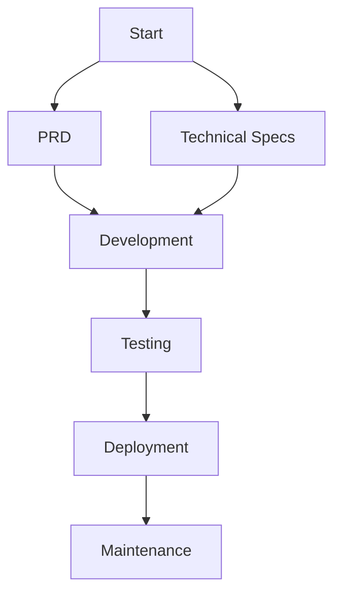

# ScriptFlow AI Documentation Hub

## Core Documentation
- [Product Requirements (PRD)](/docs/prd.md) - High-level product vision and specs
- [User Flows](/docs/user-flows.md) - MVP user journeys and edge cases
- [AI Integration Strategy](/docs/ai-providers.md) - Provider comparisons and architecture

## Technical Specifications
- [Frontend Architecture](/docs/frontend.md)
  - Component Structure
  - State Management
  - Performance Patterns
- [Backend Services](/docs/backend.md)
  - Database Schema
  - API Endpoints
  - Convex Integration
- [API Documentation](/docs/api.md) - Endpoint specs and examples
- [Database Design](/docs/database.md) - Schema evolution and migrations

## Development Practices
- [DevOps Setup](/docs/devops.md)
  - Hosting Architecture
  - CI/CD Pipeline
  - Monitoring
- [Testing Strategy](/docs/testing.md) - Unit, Integration, E2E tests
- [Security & Auth](/docs/security-auth.md) - Clerk integration and RBAC
- [State Management](/docs/state-management.md) - Data flow patterns

## Additional Resources
- [UI Theme Guide](/docs/theme.md) - Design system and components
- [Third-Party Libraries](/docs/third-party-libs.md) - Dependency audit
- [Documentation Standards](/docs/documentation.md) - How we maintain docs

> Pro tip: Use `CTRL+P` in VS Code to quickly jump between docs. Each document contains cross-references to related files.
