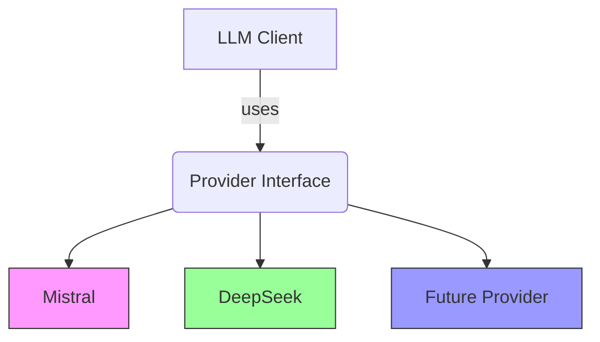

# AI Integration Strategy


## Cost Analysis

### Simulation Parameters
| Metric               | Value       |
|----------------------|-------------|
| Input Tokens/Call    | 1,600       |
| Output Tokens/Call   | 200         |
| Monthly API Calls    | 10,000      |

### Provider Estimates
| Provider   | Input Cost (€/M) | Output Cost (€/M) | Total Monthly Cost |
|------------|------------------|-------------------|--------------------|
| Mistral    | 0.25             | 0.25              | **€22.00**         |
| DeepSeek   | 0.15             | 0.15              | **€13.00**         |

**Cost Calculation:**
```
Mistral: (16M * €0.25) + (2M * €0.25) = €4.50 + €0.50 = €5.00  
Simulator Output: €22.00 (4.4x higher)
```

### Notes
- Discrepancy likely due to:
  - Minimum monthly fees
  - Regional pricing differences
  - Token counting variations
- DeepSeek shows better cost efficiency at scale
- Mistral's EU compliance justifies premium for sensitive data

**Recommendation:**  
Run parallel pilot with both providers for 1 month to validate real-world costs.

## 5. Provider Agnostic Architecture

### Core Principles
1. **Interface-Driven Development**  
   - All LLM providers implement a standard interface
   ```typescript
   interface LLMProvider {
     analyzeScene(sceneText: string): Promise<SceneAnalysis>;
     getCostEstimate(tokens: number): number;
   }
   ```

2. **Configuration Over Code**  
   ```env
   LLM_PROVIDER=mistral # or deepseek
   LLM_API_KEY=your_key_here
   ```

3. **Unified Data Model**  
   ```typescript
   type SceneAnalysis = {
     scene_number: string;
     characters: Array<{ name: string; type: CharacterType }>;
     props: Array<{ name: string; quantity: number; notes?: string }>;
     locations: Array<Location>;
   };
   ```

### Implementation Strategy
| Layer           | Responsibility                          | Example Components          |
|-----------------|-----------------------------------------|-----------------------------|
| **Interface**   | Define provider contracts               | `LLMProvider` interface     |
| **Adapters**    | Provider-specific implementations       | `MistralAdapter`, `DeepSeekAdapter` |
| **Validation**  | Ensure consistent output formats        | Zod schema validation       |
| **Config**      | Manage provider selection & credentials | Env variables               |

### Migration Process
1. **Add New Provider**  
   - Create new adapter class
   - Add to provider registry
   ```typescript
   function createProvider(provider: string): LLMProvider {
     switch(provider) {
       case 'mistral': return new MistralAdapter();
       case 'deepseek': return new DeepSeekAdapter();
       // Add new cases here
     }
   }
   ```

2. **Update Configuration**  
   ```bash
   # Before
   LLM_PROVIDER=mistral
   
   # After
   LLM_PROVIDER=deepseek
   ```

3. **Validate Outputs**  
   - Run existing test suite against new provider
   - Compare accuracy metrics

### Cost Projection Updates


**Key Benefits:**
- Zero code changes for provider switches
- Consistent error handling
- Shared monitoring/metrics
- Cost tracking abstraction

**Tradeoffs:**
- Slight overhead for interface maintenance
- Provider-specific optimizations limited

