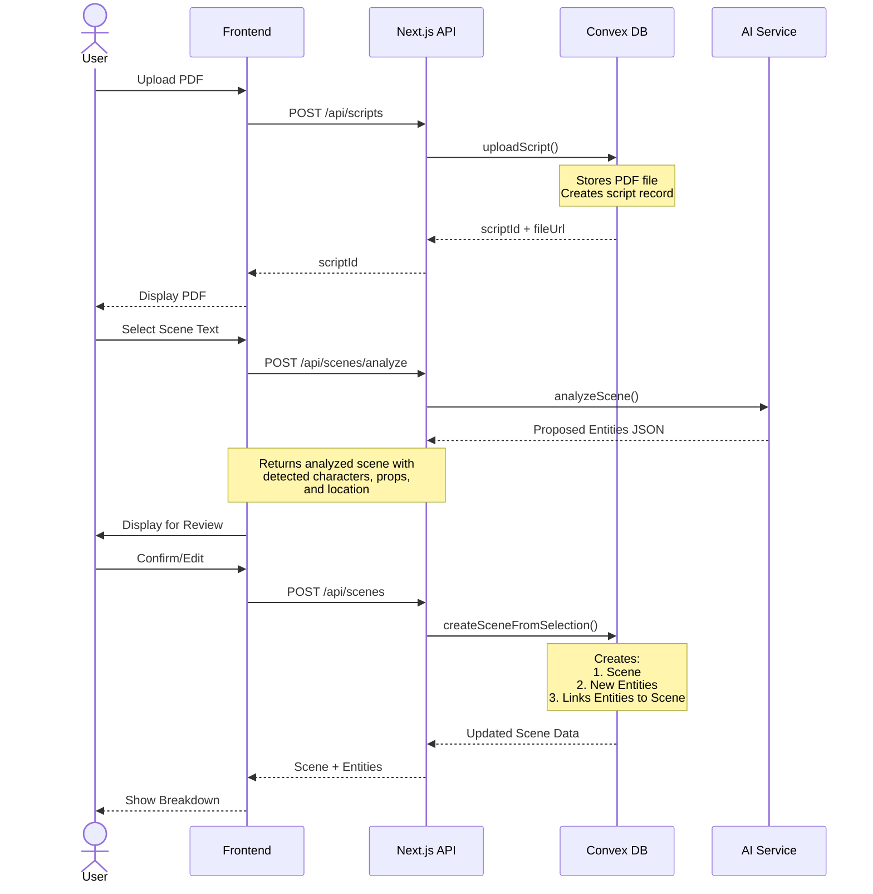

# Backend Documentation

## 1. Architecture Overview
A layered backend architecture:
1. Next.js API Routes (Backend for Frontend)
   - Handle client requests
   - Manage session state
   - Route to Convex operations
2. Convex Backend (Core Business Logic)
   - PDF storage and processing
   - AI-powered scene analysis
   - Database operations
   - Real-time updates

## 2. Technical Stack
### Core Platform
- **Next.js API Routes**: Backend-for-Frontend layer
  - Type-safe API endpoints
  - Session management
  - Request validation
- **Convex**: Core backend platform
  - TypeScript-first approach
  - Real-time data synchronization
  - Built-in PDF file handling
  - AI/Vector search capabilities

### Database Schema
```typescript
interface Script {
  id: Id<"scripts">
  userId: string
  name: string
  uploadedAt: number
  fileId: string
  metadata: {
    pageCount: number
    version?: string
    status: "processing" | "ready" | "error"
    lastModified: number
  }
  entities: {
    characters: Id<"characters">[]
    props: Id<"props">[]
    costumes: Id<"costumes">[]
    locations: Id<"locations">[]
  }
}

type CharacterType = "PRINCIPAL" | "SECONDARY" | "FIGURANT" | "SILHOUETTE" | "EXTRA"

interface Character {
  id: Id<"characters">
  scriptId: Id<"scripts">
  primaryName: string
  aliases: string[]
  type: CharacterType
  firstAppearance: number
  notes?: string
}

interface Prop {
  id: Id<"props">
  scriptId: Id<"scripts">
  name: string
  aliases: string[]
  category?: string
  quantity: number = 1    // Default to 1 if not specified
  notes?: string
}

interface Location {
  id: Id<"locations">
  scriptId: Id<"scripts">
  name: string
  address?: string
  coordinates?: {
    lat: number
    lng: number
  }
  notes?: string
}

interface Scene {
  id: Id<"scenes">
  scriptId: Id<"scripts">
  content: string
  elements: {
    characters: {
      characterId: Id<"characters">
      mentionedAs: string    // The actual text used in scene
    }[]
    props: {
      propId: Id<"props">
      mentionedAs: string
    }[]
    // Similar structure for costumes and locations
  }
  metadata: {
    pageNumber: number
    location: {
      locationId: Id<"locations">
      type: "INT" | "EXT"
      timeOfDay?: "DAY" | "NIGHT" | "DAWN" | "DUSK"
    }
    selectionCoordinates?: {
      x1: number, y1: number,
      x2: number, y2: number
    }
  }
}
```

## 3. Core Functions

### Phase 1 - Initial Flow (Bare Minimum)
#### Queries
- `getScript`: Fetch script metadata and scenes
- `getSceneBreakdown`: Get detailed breakdown for a scene

#### Mutations
- `uploadScript`: Handle new script uploads
- `deleteScript`: Remove script and cascade delete all related entities
- `createSceneFromSelection`: Create new scene from PDF selection with its entities

#### Actions
- `analyzeScene`: Process scene text with AI and return proposed entities JSON

### Phase 2 - MVP Completion
#### Queries
- `listScripts`: Get all uploaded scripts
- `getCharacters`: List all characters in a script
- `getProps`: List all props in a script
- `getLocations`: List all locations

#### Mutations
- `createCharacter`: Create new character
- `createProp`: Create new prop
- `createLocation`: Create new location
- `updateCharacter`: Edit character details
- `updateProp`: Edit prop details
- `updateLocation`: Edit location details
- `deleteCharacter`: Cascade delete character and its scene references
- `deleteProp`: Cascade delete prop and its scene references
- `deleteLocation`: Cascade delete location and its scene references
- `linkEntityToScene`: Add entity to scene
- `unlinkEntityFromScene`: Remove entity from scene
- `updateSceneBreakdown`: Update scene elements

### Phase 3 - First Iteration (Enhanced Features)
#### Queries
- `searchScenes`: Find scenes by content/elements
- `getScriptStats`: Get breakdown counts and totals

#### Mutations
- `updateCharacter`: Edit character details
- `updateProp`: Edit prop details
- `updateLocation`: Edit location details
- `deleteScene`: Remove a scene

#### Actions
- `exportBreakdown`: Generate reports

### Phase 4 - Advanced Features
#### Mutations
- `mergeEntities`: Combine semantically similar entities of the same type

#### Actions
- `findSimilarEntities`: Compare new entity against existing ones of same type

## 4. AI Integration
- Scene element detection using AI models
- Real-time processing of selected text
- Confidence scoring for detected elements

## 5. Data Flow



## 6. Security Considerations
```typescript
// convex/auth.ts
export const assertScriptAccess = async (ctx: QueryCtx, scriptId: Id<"scripts">) => {
  const script = await ctx.db.get(scriptId)
  const userId = (await getAuth(ctx)).userId
  
  if (!script || script.userId !== userId) {
    throw new Error('Access denied')
  }
}

// Example usage in script query
export const getScript = query({
  handler: async (ctx, { scriptId }) => {
    await assertScriptAccess(ctx, scriptId)
    return ctx.db.get(scriptId)
  }
})
```

### Access Control Flow
1. Frontend passes script ID
2. Backend verifies user owns script via `assertScriptAccess`
3. All subsequent operations inherit this permission check

### Updated Phase 1 Mutation
```typescript
export const uploadScript = internalMutation({
  handler: async (ctx, { name, fileId }) => {
    const auth = getAuth(ctx)
    if (!auth.userId) throw new Error('Unauthorized')
    
    return ctx.db.insert("scripts", {
      userId: auth.userId, // Store owner
      name,
      fileId,
      uploadedAt: Date.now(),
      metadata: { /* ... */ }
    })
  }
})

## 7. API Routes Structure

*For full endpoint specifications including request/response formats, see [API Documentation](./api.md).*

```typescript
/app
└── api
    ├── scripts
    │   ├── route.ts              // Implements Phase 1 POST/Phase 2 GET
    │   └── [scriptId]
    │       ├── route.ts          // Phase 1: GET/DELETE
    │       └── characters.ts     // Phase 2: GET: list script characters
    │   ├── props.ts          // Phase 2: GET: list script props
    │   ├── locations.ts      // Phase 2: GET: list script locations
    │   └── stats.ts          // Phase 3: GET: script statistics
    │
    ├── scenes
    │   ├── route.ts              // Phase 1: POST: create scene
    │   ├── analyze.ts            // Phase 1: POST: AI analysis
    │   └── [sceneId]
    │       ├── route.ts          // Phase 2: GET/PUT/DELETE
    │       └── entities.ts       // Phase 2: POST: link, DELETE: unlink
    │
    ├── entities
    │   ├── route.ts              // Phase 2: POST: create entity
    │   ├── similar.ts            // Phase 4: POST: find similar
    │   └── [entityId]
    │       ├── route.ts          // Phase 2: GET/PUT/DELETE
    │       └── merge.ts          // Phase 4: POST: merge with another
    │
    └── exports
        └── route.ts              // Phase 3: GET: generate breakdown export
```

### API Routes Summary by Phase

#### Phase 1 (Initial Flow)
- `POST /api/scripts` - Upload new script
- `GET /api/scripts/[id]` - Get script details
- `DELETE /api/scripts/[id]` - Delete script
- `POST /api/scenes` - Create new scene
- `POST /api/scenes/analyze` - Analyze scene text

#### Phase 2 (MVP Completion)
- `GET /api/scripts` - List all scripts
- `GET /api/scripts/[id]/characters` - List script characters
- `GET /api/scripts/[id]/props` - List script props
- `GET /api/scripts/[id]/locations` - List script locations
- `GET/PUT/DELETE /api/scenes/[id]` - Scene management
- `POST/DELETE /api/scenes/[id]/entities` - Entity linking
- `POST /api/entities` - Create new entity
- `GET/PUT/DELETE /api/entities/[id]` - Entity management

#### Phase 3 (Enhanced Features)
- `GET /api/scripts/[id]/stats` - Get script statistics
- `GET /api/exports` - Generate breakdown export

#### Phase 4 (Advanced Features)
- `POST /api/entities/similar` - Find similar entities
- `POST /api/entities/[id]/merge` - Merge with another entity 