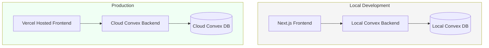
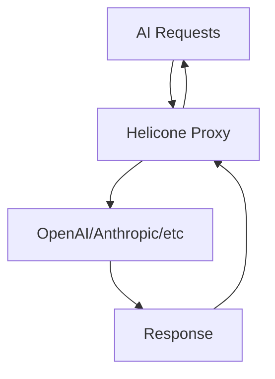
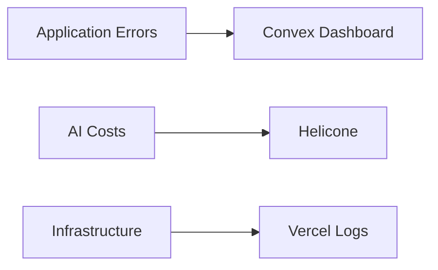
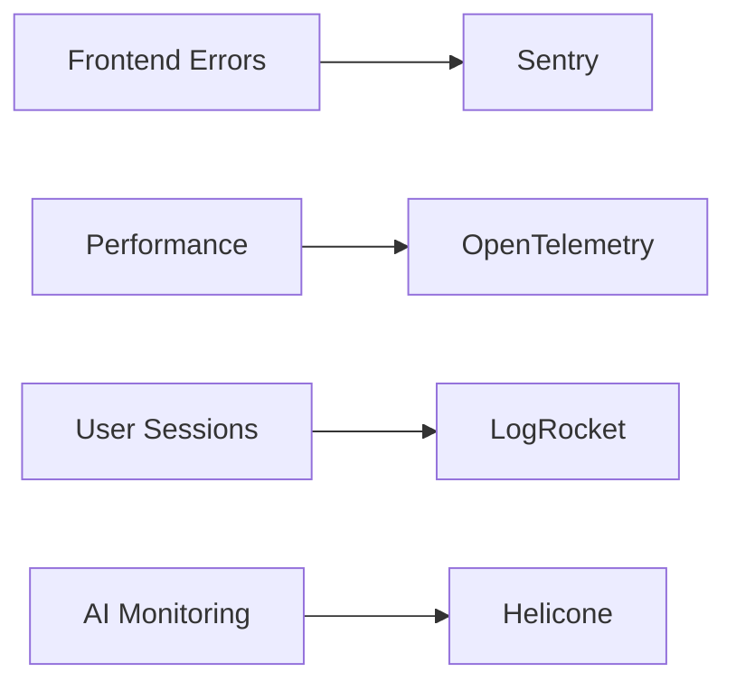

# DevOps Documentation

## 1. Hosting Architecture Update

### Development vs Production


### Local Development Setup
```bash
# 1. Start local Convex backend (see Convex dev workflow)
npx convex dev

# 2. Environment variables (.env.local)
NEXT_PUBLIC_CONVEX_URL="http://localhost:3000"
CONVEX_DEPLOYMENT="dev"
```

### Production Setup
```bash
# 1. Deploy to Convex Cloud (see production docs)
npx convex deploy

# 2. Environment variables (Vercel)
NEXT_PUBLIC_CONVEX_URL="https://<your>.convex.cloud"
CONVEX_DEPLOYMENT="prod"
```

## 2. Free Tier Strategy
```typescript
// convex.json
{
  "team": "your-team-name",
  "project": "your-project",
  "prodUrl": "https://your-project.convex.cloud",
  "freeTierOptions": {
    "maxStorageMB": 1000, // Free tier limit
    "maxMonthlyRequests": 50000,
    "aiProcessing": "openai-direct" // Bypass Convex AI costs
  }
}
```

### Key References:
- [Convex Development Workflow](https://docs.convex.dev/understanding/workflow)
- [Production Deployment Guide](https://docs.convex.dev/production)
- [Free Tier Limits](https://www.convex.dev/pricing)

### Cost Control Measures
1. **Local Development**: Entirely free (no cloud usage)
2. **Staging Environment**: Use Convex free tier
3. **Production**: 
   - Stay within free tier limits
   - Only pay for overages ($0.50/GB storage, $1/million requests)
   - Monitor usage via `npx convex dashboard`

## 3. Environment Switching
```typescript
// lib/convex.ts
import { ConvexHttpClient } from "convex/browser";

const client = new ConvexHttpClient(
  process.env.NEXT_PUBLIC_CONVEX_URL!,
  process.env.CONVEX_DEPLOYMENT === "prod"
);

// Usage remains identical across environments
const script = await client.query("getScript", { id: "123" });
```

### Key Benefits
1. Zero cloud costs during development
2. Instant local iteration
3. Same codebase works in both environments
4. Easy to promote local changes to prod

Official Docs Reference:
- [Local Development Guide](https://docs.convex.dev/development)
- [Environment Configuration](https://docs.convex.dev/production/environments)
- [Free Tier Limits](https://www.convex.dev/pricing)

## 4. CI/CD Pipeline

### Phase 1 (Initial)
```yaml
# .github/workflows/ci.yml
name: CI
on: [push]

jobs:
  checks:
    runs-on: ubuntu-latest
    steps:
      - uses: actions/checkout@v4
      - uses: actions/setup-node@v3
        with:
          node-version: 20
      - run: npm ci
      - run: npm run lint
      - run: npm run typecheck
```

### Phase 2 (Add Testing)
```yaml
# Updated workflow
jobs:
  checks:
    # ... existing steps ...
    - run: npm run test:unit
    - run: npm run test:integration

  deploy:
    needs: checks
    runs-on: ubuntu-latest
    if: github.ref == 'refs/heads/main'
    steps:
      - uses: actions/checkout@v4
      - uses: actions/setup-node@v3
      - run: npm ci
      - run: npm run build
      - run: npx convex deploy
      - uses: amondnet/vercel-action@v30
        with:
          vercel-token: ${{ secrets.VERCEL_TOKEN }}
          vercel-org-id: ${{ secrets.VERCEL_ORG_ID }}
          vercel-project-id: ${{ secrets.VERCEL_PROJECT_ID }}
```

### Critical Paths
```bash
# Local checks (pre-commit)
npm run lint
npm run typecheck

# Production deploy requires:
1. All checks passing
2. Main branch
3. Successful build
4. Convex deployment
```

## 5. AI Cost Monitoring

### Provider-Agnostic Tracking
```typescript
// lib/ai.ts
const AI_PROVIDER_URL = process.env.AI_BASE_URL // OpenAI, Anthropic, etc

export const aiClient = new AIClient({
  apiKey: process.env.AI_API_KEY,
  baseURL: "https://monitor.helicone.ai/v1",
  headers: {
    "Helicone-Auth": `Bearer ${process.env.HELICONE_API_KEY}`,
    "Helicone-Provider": "openai", // Or anthropic, etc
    "Helicone-Property-ScriptId": "{{scriptId}}",
  },
});
```

### Unified Monitoring
1. Track costs across multiple AI providers
2. Set budget alerts regardless of provider
3. Analyze usage patterns



### Key Benefits
1. Switch providers without changing monitoring
2. Compare model costs
3. Detect provider-specific issues

[Helicone Multi-Provider Docs](https://www.helicone.ai/docs/providers)

## 6. Monitoring Roadmap

### Phase 1 (Initial)


### Phase 2 (Enhanced)


### Implementation Plan
1. **Phase 1**: Use built-in platform tools (Convex/Vercel/Helicone)
2. **Phase 2**: Add:
   - Sentry for error tracking
   - OpenTelemetry for distributed tracing
   - LogRocket for session replays
   - Prometheus/Grafana for infra metrics

[Current Monitoring Setup](#3-monitoring-setup)