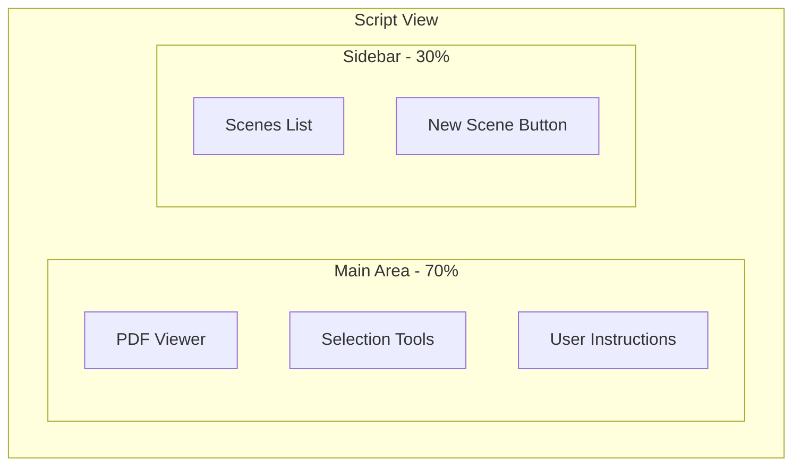

# Frontend Documentation

## 1. Architecture Overview
A modern, dashboard-based web application built with Next.js, focusing on professional-grade UI and efficient workflow for film production teams.

## 2. Technical Stack
### Core Framework
- **Next.js/React**: Leveraging server components and app router for optimal performance
- **TypeScript**: For type safety and better development experience

### UI Components
- **shadcn/ui**: Primary component library
- **Tailwind CSS**: Utility-first styling
- **PDF.js**: PDF rendering and text selection

## 3. Dashboard Structure

### Home Layout
```
+------------------+------------------+
|     Header       |                 |
+------------------+                 |
|                                   |
|        Upload PDF Button          |
|                                   |
|     (Recent Scripts - Phase 2)    |
|                                   |
+-----------------------------------+
```

### Script View Layout
```
+------------------+------------------+
|     Header       | Script Name      |
+------------------+------------------+
|                  |                  |
|   PDF Viewer     |   Scenes List    |
|    (70%)         |     (30%)        |
|                  |                  |
| - Zoom Controls  | - Scene Items    |
| - Text Selection | - Create New     |
| - Page Nav       | - Quick Actions  |
|                  |                  |
+------------------+------------------+
```

### Analysis Modal
```
+--------------------------------+
|        Analysis Modal          |
|  +----------------------------+|
|  |    Selected Text Preview   ||
|  +----------------------------+|
|  |    Detected Entities       ||
|  |  - Characters             ||
|  |  - Props                  ||
|  |  - Location               ||
|  +----------------------------+|
|  |   Confirm / Edit Actions   ||
|  +----------------------------+|
+--------------------------------+
```

### Scene Breakdown View
```
+--------------------------------+
|  Header + Back to Script       |
+--------------------------------+
|        Scene Information       |
+--------------------------------+
|                                |
|      Breakdown Grid            |
|   +----------------------+     |
|   |     Characters      |     |
|   +----------------------+     |
|   |       Props         |     |
|   +----------------------+     |
|   |      Location       |     |
|   +----------------------+     |
|                                |
+--------------------------------+
```

## 4. Core Components
1. **PDFViewer**
   - Text selection capability
   - Scene boundary visualization
   - Zoom and navigation controls

2. **BreakdownSheet**
   - Dynamic element categorization
   - Edit/correction interface
   - Export preview

3. **NavigationSystem**
   - Context-aware breadcrumbs
   - Quick scene switching
   - Progress indicators

## 5. State Management
- Local component state for UI interactions
- Server state for PDF processing
- Persistent state for user preferences 

## Phase 1 - Core User Journey

### 1. Home Screen (/)


**What user sees:**
- Clean, centered upload button
- "Drop your script here or click to upload"
- Simple header with app name
- Empty state for recent scripts (Phase 1)

**User actions:**
- Click upload or drag & drop PDF
- → Redirects to `/scripts/[scriptId]` after upload

### 2. Script View (/scripts/[scriptId])


**What user sees:**
- **Main Area (70%)**
  - PDF displayed with zoom/scroll
  - Clear instructions: "Select scene text to analyze"
  - Selection highlight as they drag
  - "Analyze Selection" button appears when text selected

- **Sidebar (30%)**
  - List of saved scenes
    - Scene number
    - First line/title
    - Quick actions (view/edit)
  - "Create New Scene" button
  - Empty state: "No scenes yet. Select text to create your first scene"

**User actions:**
- Scroll/zoom PDF
- Select text
- Click "Analyze Selection"
- Click existing scene to view its breakdown
- → Opens analysis modal for new scenes
- → Goes to /scripts/[scriptId]/scenes/[sceneId] for existing scenes

### 3. Analysis Modal (same route, modal UI)


**What user sees:**
- Modal overlay
- Selected text preview
- AI-detected entities:
  - Characters
  - Props
  - Location
- Confirm/Edit buttons

**User actions:**
- Review AI analysis
- Edit if needed
- Confirm
- → Creates scene and shows breakdown

### 4. Scene Breakdown (/scripts/[scriptId]/scenes/[sceneId])


**What user sees:**
- Scene number/reference
- Organized breakdown of:
  - Characters
  - Props
  - Location
- Link back to script

**User actions:**
- Review breakdown
- Return to script for next scene

### Navigation Flow


## 6. Next.js Architecture

### App Router Structure
```typescript
app/
├── layout.tsx               // Root layout: theme, providers
├── page.tsx                // Home: Upload interface
│
├── scripts/
│   ├── layout.tsx          // Scripts layout: navigation
│   ├── page.tsx           // Scripts list (Phase 2)
│   │
│   └── [scriptId]/
│       ├── layout.tsx      // Script layout: sidebar
│       ├── page.tsx       // PDF viewer + scenes
│   │
│   └── scenes/
│       ├── page.tsx   // Scenes list
│       └── [sceneId]/
│           └── page.tsx // Scene breakdown
```

### Key Architectural Decisions
1. **App Router (app/)**
   - Server Components by default
   - Better streaming support
   - Intuitive layouts
   - Improved data fetching

2. **Component Strategy**
   ```typescript
   // Server Component by default
   async function ScriptViewer({ scriptId }: { scriptId: string }) {
     const script = await fetchScript(scriptId)
     return <PDFViewer script={script} />
   }

   // Client Component when needed
   'use client'
   function PDFViewer({ script }: { script: Script }) {
     // Interactive PDF functionality
   }
   ```

3. **Data Flow**
   - Server Components for data fetching
   - Client Components for interactivity
   - Route Handlers for API endpoints

4. **Layout Structure**
   ```typescript
   // app/layout.tsx
   export default function RootLayout({
     children
   }: {
     children: React.ReactNode
   }) {
     return (
       <html lang="en">
         <body>
           <ThemeProvider>
             <Navigation />
             {children}
           </ThemeProvider>
         </body>
       </html>
     )
   }
   ```

### Performance Benefits
1. Automatic code splitting
2. Server-side rendering
3. Progressive enhancement
4. Streaming for large PDFs 

## 7. Project Structure

```typescript
src/
├── app/                      // Next.js App Router
│   ├── layout.tsx
│   ├── page.tsx
│   │
│   ├── scripts/
│   │   ├── layout.tsx
│   │   ├── page.tsx
│   │   │
│   │   └── [scriptId]/
│   │       ├── layout.tsx
│   │       ├── page.tsx
│   │       │
│   │       └── scenes/
│   │           ├── page.tsx
│   │           └── [sceneId]/
│   │               └── page.tsx
│   │
│   └── api/
│       └── scripts/
│           └── route.ts
│
├── components/             // ALL components live here
│   ├── ui/                // shadcn + basic UI
│   │   ├── button.tsx
│   │   └── dialog.tsx
│   │
│   ├── pdf-viewer.tsx
│   ├── scene-card.tsx
│   ├── scene-list.tsx
│   ├── breakdown-grid.tsx
│   ├── main-header.tsx
│   └── main-nav.tsx
│
├── lib/                   // Core utilities
│   ├── pdf.ts
│   ├── api.ts
│   └── utils.ts
│
├── hooks/                 // ALL hooks here
│   ├── use-pdf.ts
│   └── use-scene.ts
│
└── types/                 // Direct imports, no barrel
    ├── pdf.ts            // PDF related types
    ├── scene.ts          // Scene related types
    └── api.ts            // API types
```

### Types Usage Example

```typescript
// components/pdf-viewer.tsx
import type { PDFDocument, PDFSelection } from '@/types/pdf'

interface PDFViewerProps {
  document: PDFDocument
  onSelection: (selection: PDFSelection) => void
}

// hooks/use-pdf.ts
import type { PDFDocument } from '@/types/pdf'
import type { Scene } from '@/types/scene'

export function usePDF(doc: PDFDocument): Scene {
  // ...
}

// lib/api.ts
import type { APIResponse } from '@/types/api'
import type { Scene } from '@/types/scene'

export async function getScene(id: string): Promise<APIResponse<Scene>> {
  // ...
}
``` 

