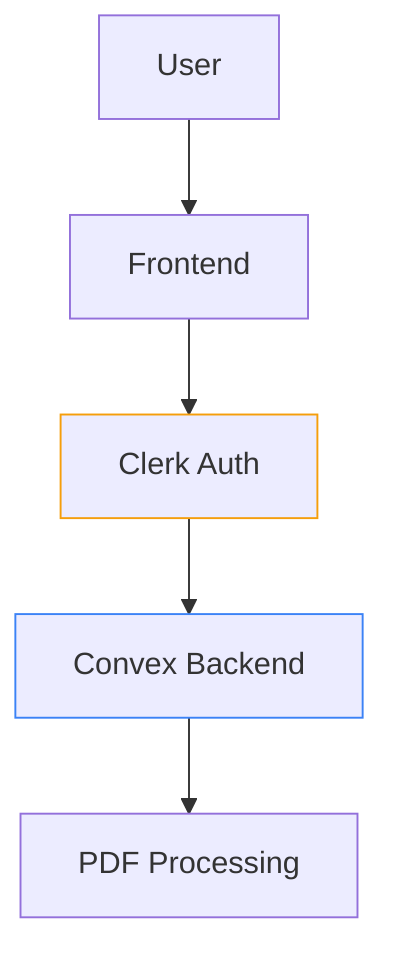

# Authentication & Security

## 1. Clerk Integration
```bash
npm install @clerk/nextjs
```

```typescript
// app/layout.tsx
import { ClerkProvider } from '@clerk/nextjs'

export default function RootLayout({
  children,
}: {
  children: React.ReactNode
}) {
  return (
    <ClerkProvider>
      <html lang="en">
        <body>{children}</body>
      </html>
    </ClerkProvider>
  )
}
```

## 2. Protected Routes
```typescript
// middleware.ts
import { authMiddleware } from '@clerk/nextjs'

export default authMiddleware({
  publicRoutes: ['/', '/sign-in', '/sign-up']
})

export const config = {
  matcher: ['/((?!.*\\..*|_next).*)', '/', '/(api|trpc)(.*)']
}
```

## 3. Auth UI Components
```tsx
// components/AuthButtons.tsx
import { 
  SignInButton, 
  UserButton, 
  SignedIn,
  SignedOut
} from '@clerk/nextjs'

export default function AuthButtons() {
  return (
    <div className="flex gap-4">
      <SignedOut>
        <SignInButton mode="modal" />
      </SignedOut>
      <SignedIn>
        <UserButton afterSignOutUrl="/" />
      </SignedIn>
    </div>
  )
}
```

## 4. Security Considerations


### Critical Protections
1. **PDF Access Control**  
```typescript
// convex/scripts.ts
export const getScript = query({
  handler: async (ctx, { scriptId }) => {
    const auth = getAuth(ctx)
    if (!auth.userId) throw new Error('Unauthorized')
    
    const script = await ctx.db.get(scriptId)
    if (script?.userId !== auth.userId) throw Error('Forbidden')
    return script
  }
})
```

2. **AI API Key Management**  
```bash
# .env.local
CLERK_SECRET_KEY=sk_***
CONVEX_CLERK_KEY=clerk_***
```

3. **Rate Limiting**  
```typescript
// app/api/analyze/route.ts
import { rateLimit } from '@clerk/nextjs'

const limiter = rateLimit({
  interval: 60_000, // 1 minute
  limit: 10 // 10 requests per user
})

export async function POST(req: Request) {
  const { userId } = auth()
  const { success } = await limiter.check(userId)
  
  if (!success) return new Response('Rate limit exceeded', { status: 429 })
  // ... analysis logic
}
```

## 5. User Management
```tsx
// app/profile/page.tsx
import { UserProfile } from '@clerk/nextjs'

export default function ProfilePage() {
  return (
    <div className="max-w-2xl mx-auto p-4">
      <UserProfile routing="path" path="/profile" />
    </div>
  )
}
```

## 6. Deployment Checklist
1. Add Clerk keys to Vercel env vars
2. Enable required auth providers (Email+Google)
3. Set JWT template for Convex:
```json
{
  "user_id": "{{user.id}}",
  "email": "{{user.email_addresses[0].email_address}}"
}
```

