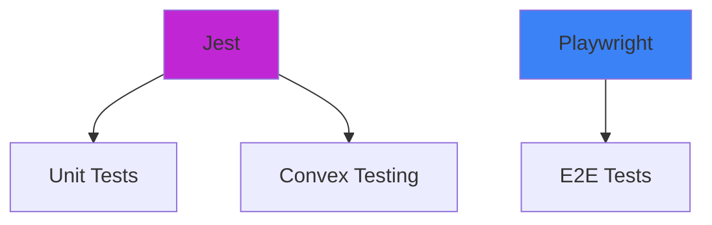
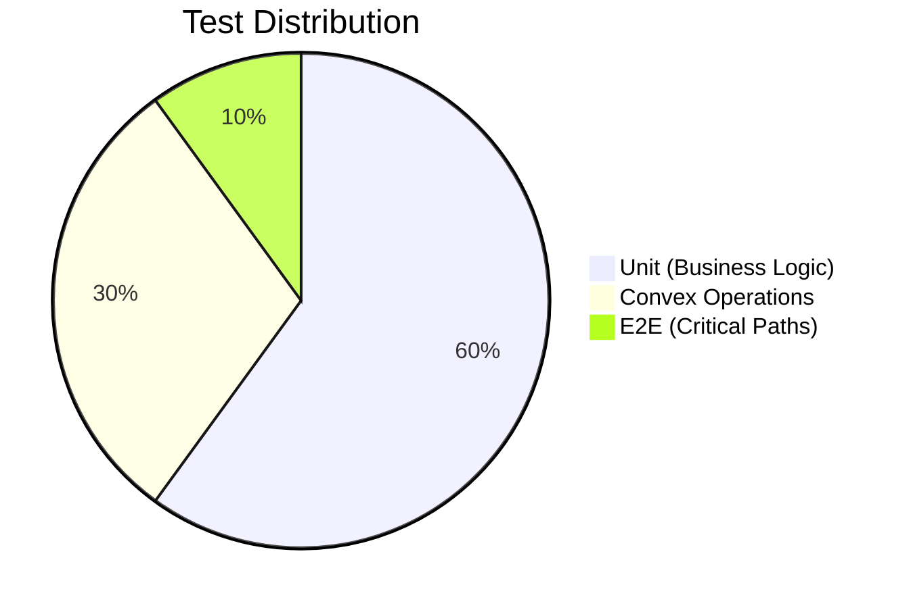

# Testing Strategy

## 1. Philosophy
"Test the important stuff, not the config"

### Guiding Principles:
1. 🛡️ Protect against regression in critical flows
2. ⚡ Fast feedback during development
3. 🤖 Automated checks for core functionality
4. 🎯 Focus on business logic over framework specifics

## 2. Tooling


### Stack Choices
| Tool       | Purpose                          | Why Chosen?                  |
|------------|----------------------------------|------------------------------|
| Jest       | Unit tests                       | Next.js default, good enough |
| Convex SDK | Test DB operations              | Official testing utilities    |
| Playwright | E2E browser tests               | Reliable, modern alternative |

## 3. Test Pyramid


## 4. Implementation Plan

### Phase 1 - Core Safety Net
```bash
# Recommended test structure
/app
├── lib
│   ├── __tests__
│   │   └── ai-utils.test.ts  # Test core AI logic
├── convex
│   ├── __tests__
│   │   └── script.test.ts    # Test Convex queries/mutations
```

```typescript
// Example unit test (jest)
// tests/ai-utils.test.ts
import { extractSceneElements } from '../lib/ai-utils'

test('extractSceneElements handles empty input', () => {
  const result = extractSceneElements('')
  expect(result.characters).toHaveLength(0)
})

test('extractSceneElements finds protagonist', () => {
  const text = "INT. BAR - NIGHT\nJohn enters, looking troubled..."
  const result = extractSceneElements(text)
  expect(result.characters).toContain('John')
})
```

```typescript
// Example Convex test (using official testing utilities)
// convex/__tests__/script.test.ts
import { test } from '@convex-dev/hello'
import { internalMutation } from './_generated/server'

// Testing Phase 1 uploadScript mutation (from backend.md)
test('uploadScript creates script with processing status', async ({ run, db }) => {
  // 1. Execute actual mutation from backend.md
  const scriptId = await run('uploadScript', {
    name: "Test Script",
    fileId: "test_123" // Matches Script interface
  })
  
  // 2. Verify database state directly (per Convex testing docs)
  const script = await db.get(scriptId)
  expect(script?.metadata.status).toBe('processing') // From Script interface
  
  // 3. Test cascade delete (Phase 1 requirement)
  await run('deleteScript', { id: scriptId })
  expect(await db.get(scriptId)).toBeNull()
})

// Testing Phase 2 entity linking (from backend.md)
test('linkEntityToScene updates scene breakdown', async ({ run }) => {
  // Setup using actual mutations
  const scriptId = await run('uploadScript', { name: "Test", fileId: "test" })
  const sceneId = await run('createSceneFromSelection', { 
    scriptId,
    content: "EXT. PARK - DAY\nJohn walks his dog"
  })
  const characterId = await run('createCharacter', {
    scriptId,
    primaryName: "John"
  })
  
  // Test entity linking mutation
  await run('linkEntityToScene', {
    sceneId,
    entityId: characterId,
    entityType: "characters",
    mentionedAs: "John"
  })
  
  // Verify through official query
  const scene = await run('getSceneBreakdown', { id: sceneId })
  expect(scene.elements.characters).toContainEqual({
    characterId,
    mentionedAs: "John"
  })
})