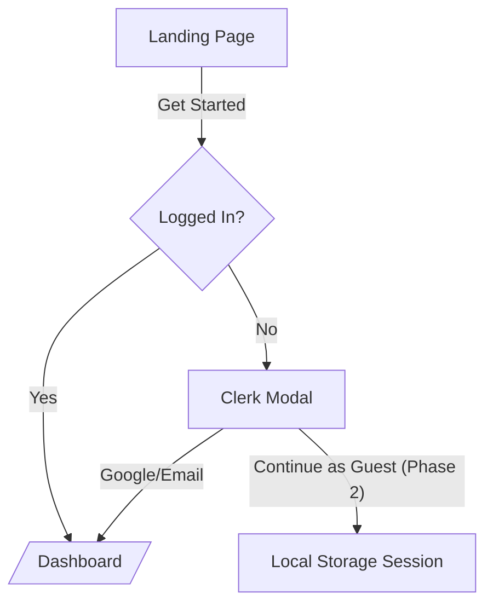
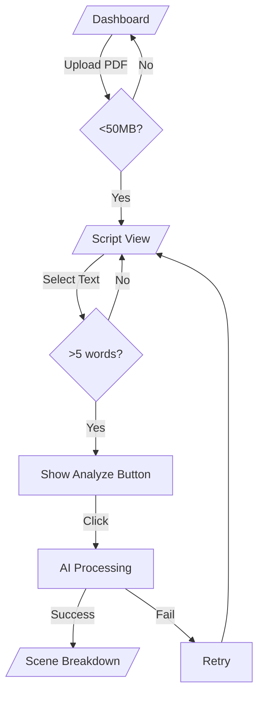
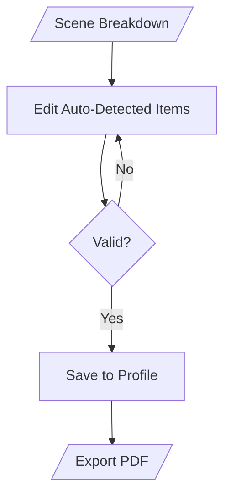

# User Flows (MVP)

## 1. Authentication

**Features:**
- Clerk pre-built modal
- Google + Email magic links
- Guest session persists until browser close
- No password management
- No email verification

---

## 2. Core Journey

**Error Handling:**
- PDF Upload: 
  - Toast: "Only PDFs under 50MB"
- AI Failures:
  - Toast: "Analysis failed. Try selecting different text"
  
---

## 3. Scene Breakdown

**Features:**
- Basic form validation (required fields)
- Export as PDF button
- No version history
- No collaboration

---

## Edge Cases Handled
1. **PDF Uploads**
   - Non-PDF files → Reject
   - >50MB → Error toast
2. **Text Selection**
   - Empty selections → Disable analyze
   - Cross-scene selections → Auto-split
3. **AI Failures**
   - Timeout → "Took too long. Try again"
   - Invalid JSON → "Technical error. Contact support"

---

## Permissions
| User Type  | Capabilities                 |
|------------|------------------------------|
| Guest      | 1 script, no saving          |
| Logged In  | 3 scripts, save to profile   |
---

